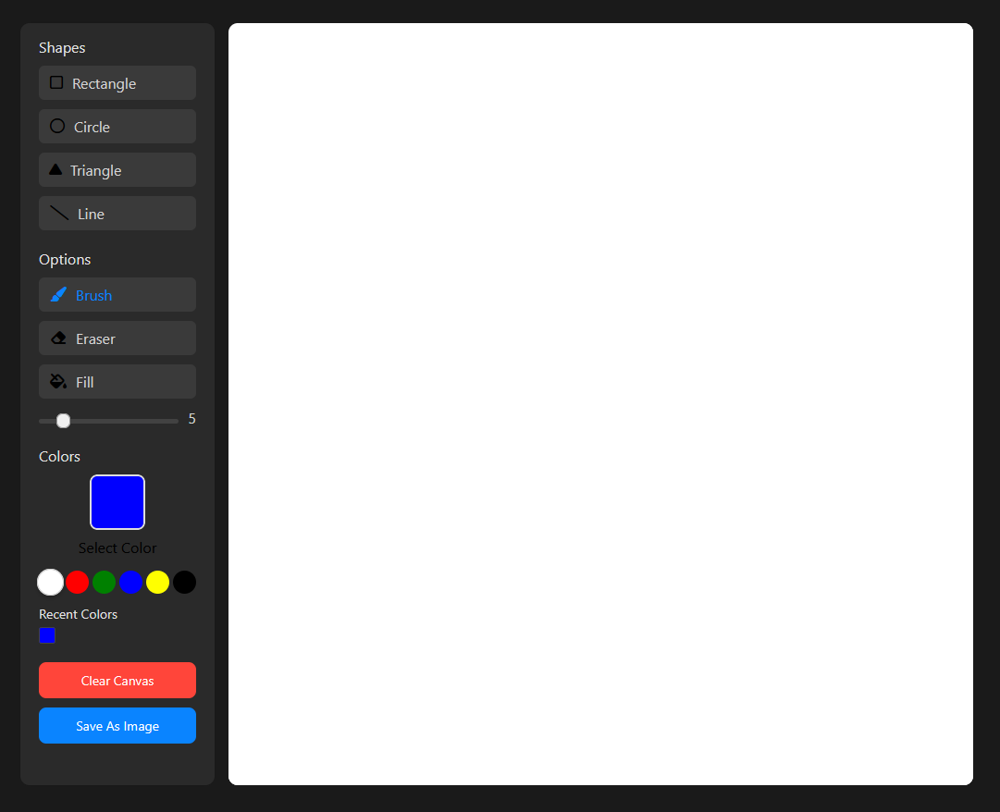

# Modern Drawing App

A sophisticated drawing application that allows users to create digital artwork with a variety of tools and features. This app combines the simplicity of classic paint programs with modern design principles and enhanced functionality.

## Features

- **Intuitive Canvas Experience**: Smooth, responsive drawing area that works on both desktop and mobile devices
- **Multiple Drawing Tools**: Brush, eraser, shapes (rectangle, circle, triangle, line)
- **Color Options**: Color picker, predefined color palette for quick selection
- **Brush Size Control**: Adjustable brush thickness with visual feedback
- **Fill Options**: Toggle between outline and filled shapes with customizable fill color
- **Save Functionality**: Download your artwork as a PNG image
- **Responsive Design**: Works seamlessly across different screen sizes
- **Dark Mode Support**: Automatically adapts to user's system preferences

## Design Principles

This Drawing App follows Apple's Human Interface Guidelines with a focus on:

- **Direct Manipulation**: The drawing interaction feels immediate and responsive, with the digital pencil directly affecting the canvas
- **Clarity**: The interface is clean and intuitive with visual cues for active tools and states
- **Consistency**: UI elements follow consistent patterns for improved usability
- **Accessibility**: High contrast controls and flexibility in input methods (touch, mouse, etc.)

## Implementation Details

The drawing app is built using:

- **HTML5 Canvas**: For the drawing functionality
- **CSS3**: For styling and responsive design
- **JavaScript**: For interactivity and canvas manipulation
- **Font Awesome**: For tool icons

## Usage Instructions

1. **Select a Tool**: Click on any tool icon from the toolbox (Brush, Eraser, or Shapes)
2. **Choose Colors**: Select drawing color from the color picker or predefined palette
3. **Adjust Settings**: Change brush size using the slider
4. **Draw**: Click and drag on the canvas to create your artwork
5. **Fill Shapes**: Toggle the "Fill color" checkbox to create filled shapes
6. **Save Your Work**: Click "Save As Image" to download your creation

## Future Enhancements

- Undo/Redo functionality
- Layer support for more complex compositions
- Text tool for adding text to drawings
- Image import functionality
- More brush styles and effects

## Credits

Designed and developed by Evgeniy Gutman as part of the Portfolio Projects collection. 