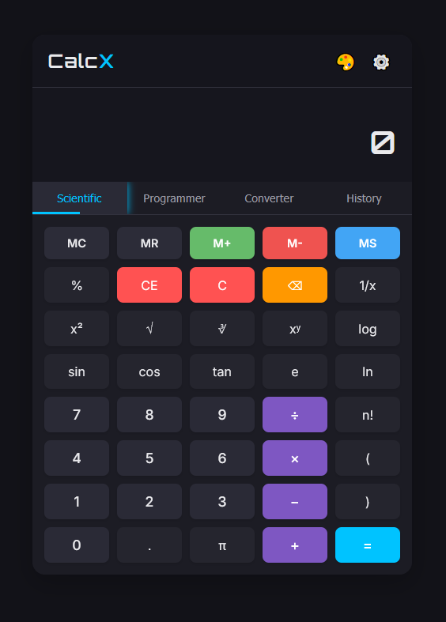

# 🧮 CalcX - Advanced JavaScript Calculator

A modern, feature-rich calculator web application built with pure HTML, CSS, and JavaScript. Calculate with style! ✨



## ✅ Features

- **Multiple Calculator Modes**:
  - 🔬 Scientific Calculator with advanced math functions
  - 💻 Programmer Calculator with binary, octal, decimal, and hexadecimal operations
  - 📏 Unit Converter for various measurement units
  - 📜 Calculation History

- **Visual Themes**:
  - 🌙 Dark (default)
  - ☀️ Light
  - 🌈 Neon
  - 👓 High Contrast

- **Customization Options**:
  - 🔍 Adjustable font size
  - 🔢 Decimal precision settings
  - 🎨 Accent color selection
  - 📐 DEG/RAD angle unit toggle

- **Additional Features**:
  - 🧠 Memory functions (MC, MR, M+, M-, MS)
  - ⌨️ Keyboard shortcuts
  - 📋 Copy results to clipboard
  - 📱 Responsive design for all devices
  - ✨ Visual effects and animations

## 🛠️ Technologies Used

- HTML5
- CSS3 (with CSS variables for theming)
- Vanilla JavaScript (ES6+)
- No external libraries or frameworks - just pure coding goodness! 💪

## 🚀 Getting Started

### Local Setup

1. Clone the repository:
   ```
   git clone https://github.com/yourusername/simple-calculator.git
   ```

2. Open `index.html` in your preferred browser. That's it! 🎉

### Usage

- 🔄 Switch between calculator modes using the tabs
- ⚙️ Access settings via the gear icon in the header
- 🎹 Use keyboard for input (press '?' for keyboard shortcuts)
- 📊 History tab keeps track of your calculations

## ⌨️ Keyboard Shortcuts

- `0-9`: Input digits
- `+`, `-`, `*`, `/`: Basic operations
- `Enter`: Calculate result
- `Backspace`: Delete last character
- `Esc`: Clear all
- `Ctrl+Z`: Undo
- `?`: Show all keyboard shortcuts

## 🌐 Browser Compatibility

Tested and works on:
- Chrome 80+ �Chrome
- Firefox 75+ 🦊
- Safari 13+ 🧭
- Edge 80+ 🌀

## 🔮 Future Enhancements

- 📅 Date and time calculations
- 💰 Financial calculations (mortgage, loan, etc.)
- 📊 Graphing capabilities
- 🎭 Custom theme creation
- 💾 Save settings to local storage

## 📄 License

This project is licensed under the MIT License - see the LICENSE file for details.

## 👏 Acknowledgments

- Inspired by Windows Calculator and Google Calculator
- Icons and sounds from open-source libraries 
- Made with ❤️ and lots of ☕