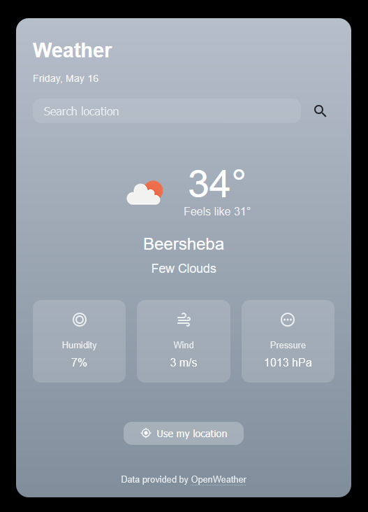

# Weather App

A clean, intuitive weather application built with HTML, CSS, and JavaScript. This app follows Apple's Human Interface Guidelines to provide a beautiful, user-friendly experience.



## Features

- **Current Weather Data**: Get real-time weather information for any location
- **Geolocation Support**: Automatically detect user's location
- **Dynamic Theming**: Background and UI change based on current weather conditions
- **Responsive Design**: Works beautifully on any device size
- **Dark Mode Support**: Automatically adjusts to system preferences
- **Persistent Data**: Remembers your last searched location

## Technologies Used

- HTML5 for semantic structure
- CSS3 for styling with custom properties and flexbox/grid layouts
- Vanilla JavaScript (ES6+) for functionality
- OpenWeatherMap API for weather data
- Browser Geolocation API for location detection

## Getting Started

### Prerequisites

- A web browser
- An OpenWeatherMap API key (get one for free at [OpenWeatherMap](https://openweathermap.org/api))

### Setup

1. Clone or download this repository
2. Open `js/app.js` and replace `YOUR_API_KEY` with your actual OpenWeatherMap API key
3. Open `index.html` in your browser

## Usage

- **Search for a Location**: Enter a city name in the search box and press Enter or click the search icon
- **Use Current Location**: Click the "Use my location" button to get weather for your current position
- **View Weather Details**: See temperature, conditions, humidity, wind speed, and pressure

## Design Philosophy

This project follows Apple's Human Interface Guidelines principles:

- **Clarity**: Focus on essential content and features
- **Deference**: The UI helps users interact with content without competing with it
- **Depth**: Visual layers and realistic motion convey hierarchy

## Project Structure

```
Weather-App/
├── css/
│   └── styles.css
├── images/
│   └── screenshot.png
├── js/
│   └── app.js
├── index.html
├── design-document.md
└── README.md
```

## Customization

- Replace `YOUR_API_KEY` in `app.js` with your actual OpenWeatherMap API key
- Modify the CSS variables in `:root` to change colors and spacing
- Add additional weather metrics or features as needed

## License

This project is licensed under the MIT License - see the LICENSE file for details.

## Acknowledgments

- [OpenWeatherMap](https://openweathermap.org/) for the weather data API
- Apple's Human Interface Guidelines for design inspiration 